# ChinaLink Express - Architecture Diagrams
## Visual Reference for Technical Implementation

---

## 1. Overall System Architecture

---

## 2. AI Sourcing Assistant - Data Flow

```mermaid
sequenceDiagram
    actor Customer
    participant Web as Web App
    participant API as Search API
    participant AI as AI Services
    participant Cache as Redis Cache
    participant Vector as Vector DB
    participant Alibaba as Alibaba API
    participant ML as ML Models

    Customer->>Web: Search "electronic components"
    Web->>API: GET /api/sourcing/search
    API->>Cache: Check cache
    
    alt Cache Hit
        Cache-->>API: Return cached results
    else Cache Miss
        API->>AI: Process query
        AI->>AI: Translate FR→CN
        AI->>AI: Extract intent & filters
        
        par Parallel Search
            AI->>Vector: Semantic search
            AI->>Alibaba: API search
        end
        
        AI->>ML: Score suppliers
        AI->>ML: Predict prices
        AI->>ML: Assess quality
        
        AI->>AI: Rank & filter results
        AI->>Cache: Store results (5min TTL)
    end
    
    API-->>Web: JSON results
    Web-->>Customer: Display products
    
    Customer->>Web: Start negotiation
    Web->>API: POST /api/sourcing/negotiate
    API->>AI: Initiate negotiation bot
    AI->>AI: Load strategy
    AI->>Alibaba: Send message
    Alibaba-->>AI: Supplier response
    AI->>AI: Analyze & respond
    API-->>Web: Negotiation status
```

---

## 3. Visual Tracking - Photo Verification Flow

---

## 4. Predictive Logistics - ETA Calculation

---

## 5. Embedded Finance - Escrow Flow

---

## 6. 3D Cargo Visualizer - Optimization Pipeline

---

## 7. Security Architecture

---

## 8. Data Architecture

---

## 9. Deployment Architecture

---

## 10. Integration Points

---

*These diagrams provide visual reference for the technical architecture described in ARCHITECTURE_DEFENSIBLE_FEATURES.md*
